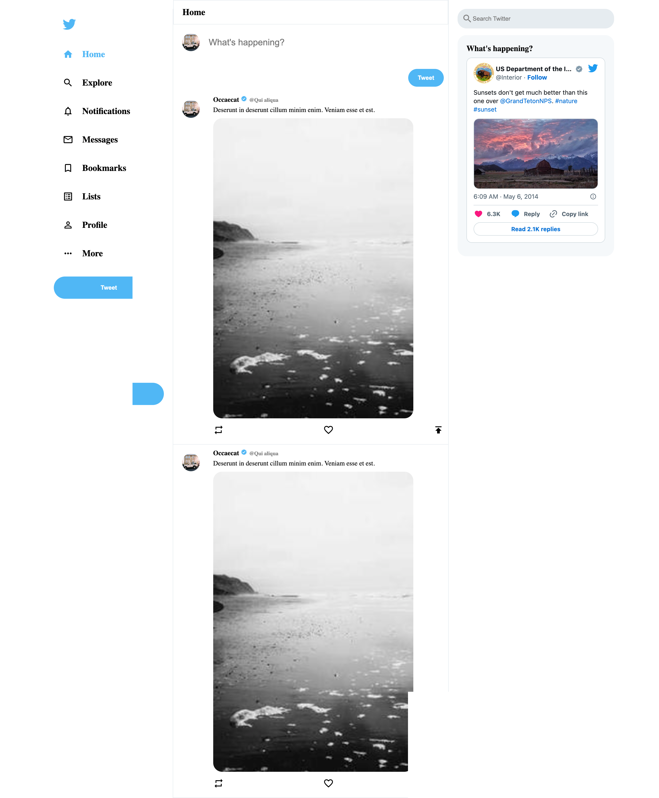

# Twitter Clone

<!-- PROJECT SHIELDS -->
<!--
*** I'm using markdown "reference style" links for readability.
*** Reference links are enclosed in brackets [ ] instead of parentheses ( ).
*** See the bottom of this document for the declaration of the reference variables
*** for contributors-url, forks-url, etc. This is an optional, concise syntax you may use.
*** https://www.markdownguide.org/basic-syntax/#reference-style-links
-->
[![Github][Github-shield]][Github-url]
[![LinkedIn][linkedin-shield]][linkedin-url]

<!-- TABLE OF CONTENTS -->

  
Table of Contents

  <ol>
    <li>
      <a href="#about-the-project">About The Project</a>
      <ul>
        <li><a href="#built-with">Built With</a></li>
      </ul>
    </li>
    <li><a href="#contact">Contact</a></li>
    <li><a href="#acknowledgments">Acknowledgments</a></li>
  </ol>

<!-- ABOUT THE PROJECT -->
## About The Project

In this project, I work with HTML and CSS to clone Twitter Clone. These projects are part of jouney to learning web development.

(<a href="#readme-top">back to top</a>)

### Built With

This section contains the tools and materials I use for my project. 

* [![HTML5][HTML5-shield]][HTML5-url]
* [![CSS3][CSS3-shield]][CSS3-url]

(<a href="#readme-top">back to top</a>)

<!-- ROADMAP -->
## Roadmap

- [x] HTML5 Basic Website
- [x] CSS3 + HTMl5 Website
- [ ] JS + CSS3 + HTML5 Website

(<a href="#readme-top">back to top</a>)

<!-- CONTACT -->
## Contact

Javian Ng - [@shotbyj.av](https://www.instagram.com/shotbyj.ave) - javian.ng.z.h@gmail.com

(<a href="#readme-top">back to top</a>)

<!-- ACKNOWLEDGMENTS -->
## Acknowledgments

Special thanks to Future Coders for the tutorial at https://youtu.be/zhH9uvTOyQM.

(<a href="#readme-top">back to top</a>)

<!-- MARKDOWN LINKS & IMAGES -->
<!-- https://www.markdownguide.org/basic-syntax/#reference-style-links -->
[GitHub-shield]: https://img.shields.io/badge/-GitHub-lightgrey?style=for-the-badge&logo=github&colorB=555
[Github-url]: https://github.com/javianng/introductiontohtml5_personalproject

[HTML5-shield]: https://img.shields.io/badge/-HTML5-black?style=for-the-badge&logo=html5&color=E34F26&logoColor=white
[HTML5-url]: https://

[linkedin-shield]: https://img.shields.io/badge/-LinkedIn-black?style=for-the-badge&logo=linkedin&colorB=555
[linkedin-url]: https://linkedin.com/in/javianngzh/

[CSS3-shield]: https://img.shields.io/badge/CSS3-1572B6?style=for-the-badge&logo=css3&logoColor=white
[CSS3-url]: https://
